# Build KVSD

## Preparation

Copy the `device_linux` package to selected directory, e.g. `/home/pi/device_linux`:
```
cp -r device_linux /home/pi/device_linux
```

Create an installation build directory and copy required files to it.
```
cd /home/pi
mkdir ayla_install_build
cp /home/pi/device_linux/dev_kit/raspberry_pi/ayla_install.sh /home/pi/ayla_install_build
```

Modify the `ayla_install.sh` script to use the `device_linux` instead of `device_linux_public` package.

Search and change line:
```
ayla_src_dir="/home/pi/device_linux_public"
```

to:
```
ayla_src_dir="/home/pi/device_linux"
```


Search and change line:
```
ayla_package="https://github.com/AylaNetworks/device_linux_public.git"
```

to:

```
ayla_package="https://github.com/AylaNetworks/device_linux.git"
```

Copy required config file `devd.conf`:
```
cp devd.conf /home/pi/ayla_install_build
```

## Install dependencies

This is needed only once per device to ease the installation process.
```
cd /home/pi/ayla_install_build
./ayla_install.sh -b
```

## Build

Start building all needed applications.

A few flags are passed to the `ayla_install.sh` script: 
- `-o` force to not use the `rel` directory during the build
- `-n` build without the WiFi support
- `-f` build all camera related applications
- `-a kvsd` build the kvsd application.

```
./ayla_install.sh -o -n -f -a kvsd
```

# Configure KVSD

The KVSD device consists of: gateway, base node and camera node. The template for those nodes needs to be created on the cloud before the application can be started.

## Create Gateway template

Create a gateway template in the Ayla Networks cloud. The template should contain the following details:

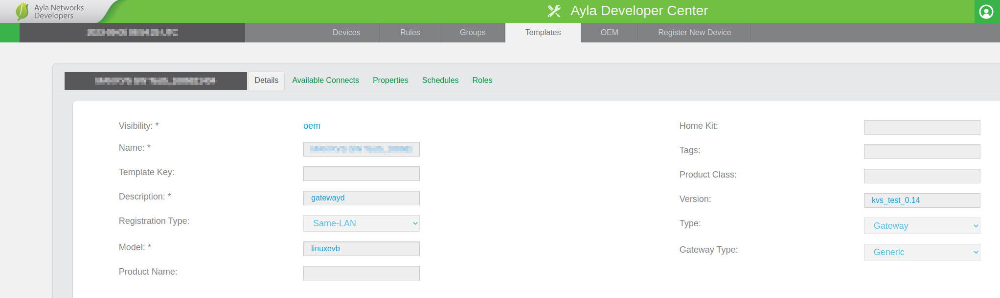

After creating the gateway template add all the needed properties to the gateway template with following details:

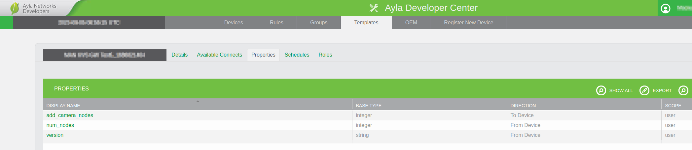

## Create Base node template

Create a base node template in the Ayla Networks cloud. The template should contain the following details:

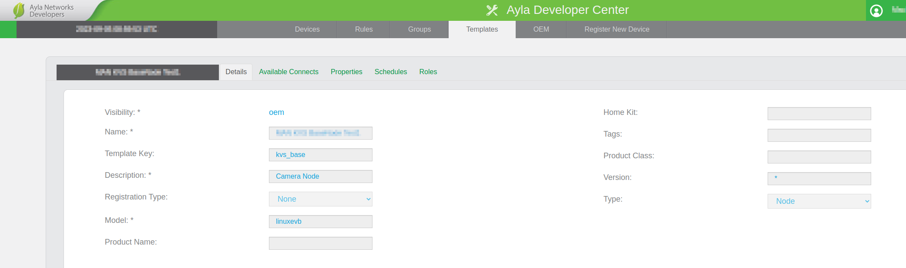

After creating the base node template add all the needed properties to the base node with following details:

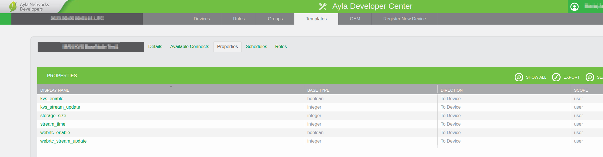

# Running KVSD

## Start / Stop

Once the KVSD application is built and the templates are created in the Ayla Networks cloud, the application can be started.

Start the service:
```
sudo service devd start
```

Stop the service:
```
sudo service devd stop
```

Check the status of the service:
```
sudo service devd status
```

Check the logs:
```
tail -f /var/log/messages
```

## Add camera

To add the camera the device needs to be registered with DSN and the user account. Once it is linked to the account and the `devd` is started the device will be visible in the 'Devices' tab.

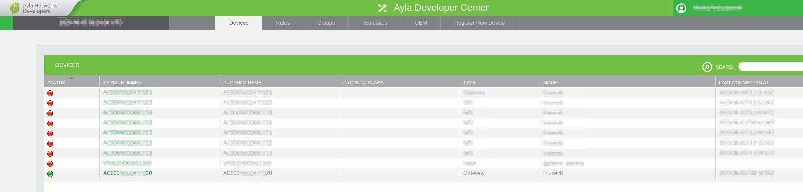

Click on the device serial number to open it. The device details will be displayed. Open the 'Properties' tab.

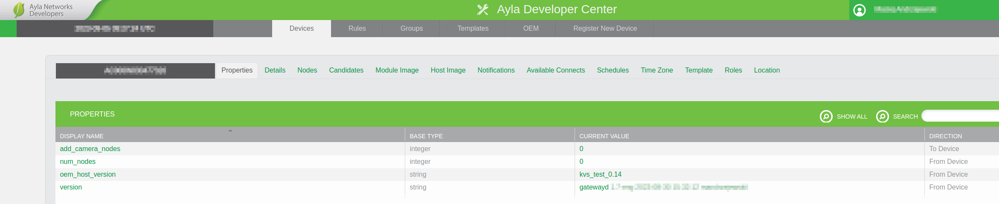

Now the new camera node will be added. Click on the value next to 'add_camera_nodes' property and set new value to '1'. The new camera node will be added to the device.

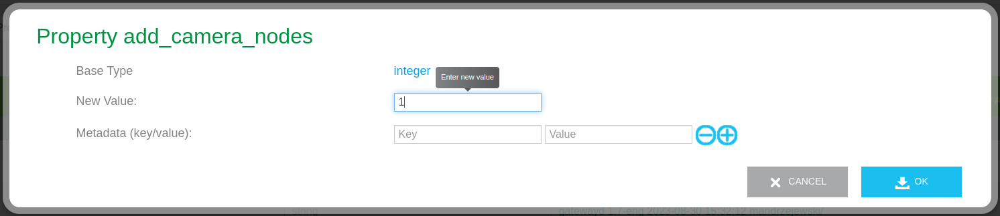

Once the camera node is ready it will be visible by the change of the value of the 'num_nodes' property. It will be set to the current number of camera nodes.

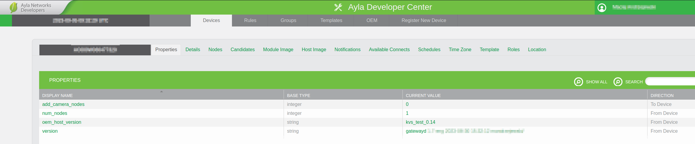

To register the candidate node open the 'Candidates' tab. The new node will be visible in the list. Click on the 'register' button to register the node.

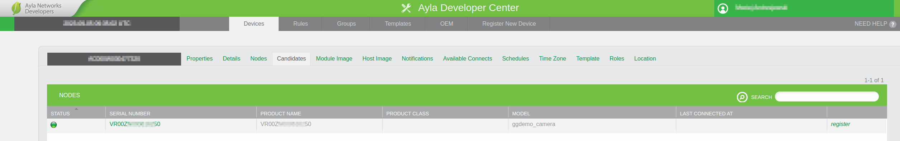

When the camera get register it will be removed from the 'Candidates' list and added to the 'Nodes' list. Switch to the 'Nodes' tab to see the list of all registered nodes.

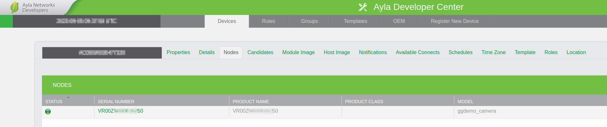

Click on the node serial number to open it. The node 'Properties' tab will be displayed. The node is now ready to be used.

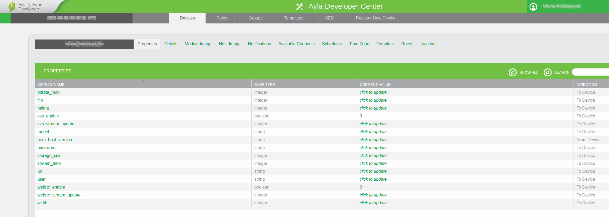

## Configure camera

The camera node can be configured by changing the values of the properties.

The properties:
* `url` - URL of the camera's RTSP stream; default value: ""; example: "rtsp://camera.com:554/live"
* `user` - username for the camera's RTSP stream; default value: ""
* `bitrate_max` - maximum bitrate of the video stream; default value: 0 (the stream will be passed unchanged)
* `password` - password for the camera's RTSP stream; default value: ""
* `kvs_enable` - enable the Amazon KVS streaming; default value: 0 (disabled)
* `webrtc_enable` - enable the WebRTC streaming; default value: 0 (disabled)
* `storage_size` - storage size in MB for the Amazon KVS stream; default value: 16
* `storage_time` - storage time in seconds for the Amazon KVS stream after which the stream is disabled; default value: 0
* `width` - width of the video stream; default value: 0 (the stream will be passed unchanged); if this is set but the `height` set to zero then it will scale based on the video original aspect ratio
* `height` - height of the video stream; default value: 0 (the stream will be passed unchanged); if this is set but the `width` set to zero then it will scale based on the video original aspect ratio
* `flip` - flip the video stream; default value: 0 (no flip)
    * none (0) – Identity (no rotation)
    * clockwise (1) – Rotate clockwise 90 degrees
    * rotate-180 (2) – Rotate 180 degrees
    * counterclockwise (3) – Rotate counter-clockwise 90 degrees
    * horizontal-flip (4) – Flip horizontally
    * vertical-flip (5) – Flip vertically
    * upper-left-diagonal (6) – Flip across upper left/lower right diagonal
    * upper-right-diagonal (7) – Flip across upper right/lower left diagonal
    * automatic (8) – Select flip method based on image-orientation tag
* `model` - model or camera name; default value: ""
* `kvs_stream_update` - forces to update the Amazon KVS credentials; service only
* `webrtc_stream_update` - forces to update the WebRTC credentials; service only
* `oem_host_version` - version of the camera firmware

When the configuration properties are changed then both of the streams needs to get disabled and reenabled again to apply the changes.

## Test camera streams

The camera streams can be tested by using the Amazon test pages. First the `url` must be filled. If the camera needs the login credentials then the `user` and `password` must also be filled. The rest of the properties can be left with the default values. 

### Amazon credentials

The Amazon credentials are stored in the `/home/pi/ayla/config/appd.conf.startup` file. The credentials are generated by the Ayla Networks cloud and are updated automatically by the service. Those credentials need to be copied to the Amazon test page to view the stream.

To view the credentials for the KVS:
```
sudo cat /home/pi/ayla/config/appd.conf.startup | grep kvs
```

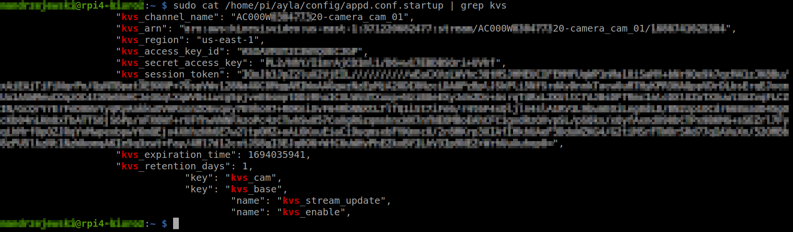

To view the credentials for the WebRTC:
```
sudo cat /home/pi/ayla/config/appd.conf.startup | grep webrtc
```

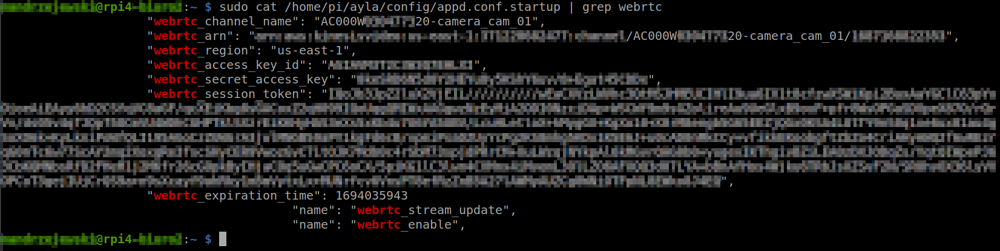

### Test HLS

To enable the HLS stream set `kvs_enable` to '1'.

Open the test page: https://aws-samples.github.io/amazon-kinesis-video-streams-media-viewer/

Fill the data as follows:

| Amazon test page             | Credentials           |
|------------------------------|-----------------------|
| Stream name                  | kvs_channel_name      |
| Region                       | kvs_region            |
| AWS Access Key               | kvs_access_key_id     |
| AWS Secret Key               | kvs_secret_access_key |
| AWS Session Token (Optional) | kvs_session_token     |

Make sure that `Streaming Protocol` is set to HLS. Select `Playback Mode` to `Live` for the live stream or set the dates as appropriate for the recorded stream. Leave other settings as in the example below.

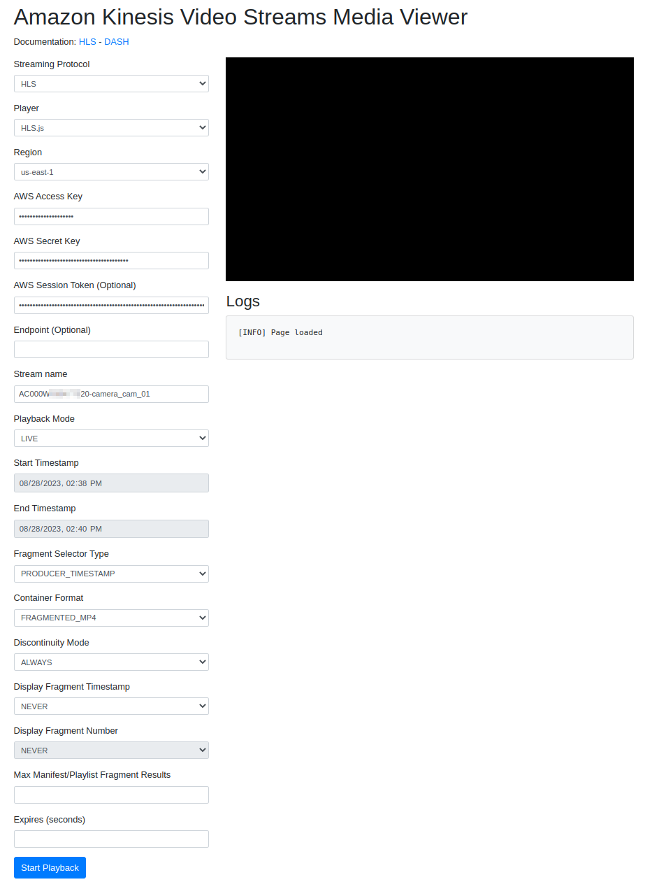

When ready press `Start Playback` to get the stream from the camera.

### Test WebRTC

To enable the WebRTC stream set `webrtc_enable` to '1'.

Open the test page: https://awslabs.github.io/amazon-kinesis-video-streams-webrtc-sdk-js/examples/index.html

Fill the data as follows:

| Test page                | Credentials              |
|--------------------------|--------------------------|
| Stream name              | webrtc_channel_name      |
| Region                   | webrtc_region            |
| Access Key ID            | webrtc_access_key_id     |
| Secret Access Key        | webrtc_secret_access_key |
| Session Token (optional) | webrtc_session_token     |

Make sure that `STUN/TURN` and `Use trickle ICE` are enabled under the `NAT Traversal` section. Leave other settings as in the example below.

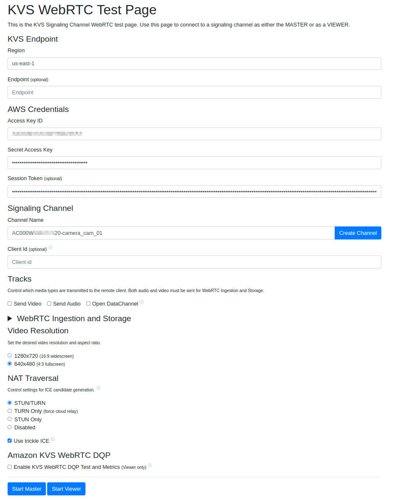

When ready press `Start Viewer` to get the stream from the camera.
